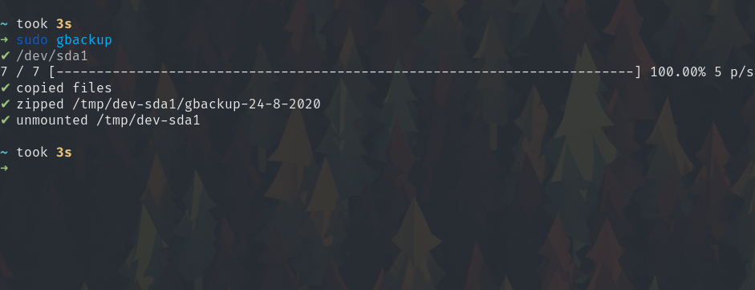

# gbackup

[](https://goreportcard.com/report/github.com/NickHackman/gbackup)

A command-line utility that backs up folders and files to a device. 

## Config

These folders and files are selected by a configuration file located on the device with a name of `gbackup.yml`.

``` yaml
# Example Configuration File for gbackup
#
# Store this file on your backup device in order to allow customization based on device and enables persistence

# Name can be a constant or contain a date format, Date formatting follows Golang's time package.
#
# NOTE: If left constant all backups will overwrite one another, it's suggested
# to use the date to distinguish names.
#
# Default: gbackup-${CURRENT_DAY}-${CURRENT_MONTH}-${CURRENT_YEAR}
#
# NOTE: Do NOT include `.zip`, it will be appended.
# 
# Example table below:
#
# 1609-09-12 19:02:35 PM +03:00 Sep Sat PDT 
# --------------- + ------------ + ------------ 
# Type            | Placeholder  |        Value 
# --------------- + ------------ + ------------ 
# Year            | 2006         | 1609         
# Year            | 06           | 09           
# Month           | 01           | 09           
# Month           | 1            | 9            
# Month           | Jan          | Sep          
# Month           | January      | September    
# Day             | 02           | 12           
# Day             | 2            | 12           
# Week day        | Mon          | Sat          
# Week day        | Monday       | Saturday     
# Hours           | 03           | 07           
# Hours           | 3            | 7            
# Hours           | 15           | 19           
# Minutes         | 04           | 02           
# Minutes         | 4            | 2            
# Seconds         | 05           | 35           
# Seconds         | 5            | 35           
# AM or PM        | PM           | PM           
# Milliseconds    | .000         | .123         
# Microseconds    | .000000      | .123456      
# Nanoseconds     | .000000000   | .123456789   
# Timezone offset | -0700        | +0300        
# Timezone offset | -07:00       | +03:00       
# Timezone offset | Z0700        | +0300        
# Timezone offset | Z07:00       | +03:00       
# Timezone        | MST          | PDT          
# --------------- + ------------ + ------------
name: gbackup-2-1-2006

# Whether or not to zip, all the backup files
#
# Default: True
zip: true

# Directories or files to backup. Directories are copied recursively.
#
# Paths can use environment variables
#
# Default: [ ]
#
# Backups have the options of `source`, `destination`, and `skip`.
backups:
  # `source` is where on the host machine a directory or file you'd like to backup
  # is located.
  #
  # NOTE: Only `~` is properly expanded, but will expand to `root`
  #
  # Required
  - source: ~/Documents

  - source: ~/Projects
    # `destination` is an optional field that if not provided is equivalent to the
    # stem of the `source`
    #
    # Default: `source`
    destination: Projects
    # `skip` is an optional field of files or paths to skip and to not copy over.
    # They can either be paths that have a prefix of `source` OR are solely stems.
    #
    # Optional
    #
    # Default: [ ]
    skip:
      # For instance, if a lot of your projects are Nodejs projects. You don't want to backup the entire universe of JavaScript packages located in your `node_modules`, this excludes them.
      - node_modules
      # The same as above, but for Rust's target/ directory.
      - target
```

## Non-Go Dependencies

### Linux
- lsblk
- mount

If it's possible to implement a better way than shelling out to `lsblk` and `mount`, please open a Pull Request.

## Screenshot



## Operating System Support

- [X] Linux
- [ ] MacOS
- [ ] Windows
- [ ] BSD

gbackup has minimal support for filesystems right now, but it's fairly trivial to implement.

In order to implement support for an operating system, it's required to implement the [`Device`](./device/device.go) interface and
an alternative to `lsblk`.

## License

Licensed under [GPLv3](./LICENSE)
